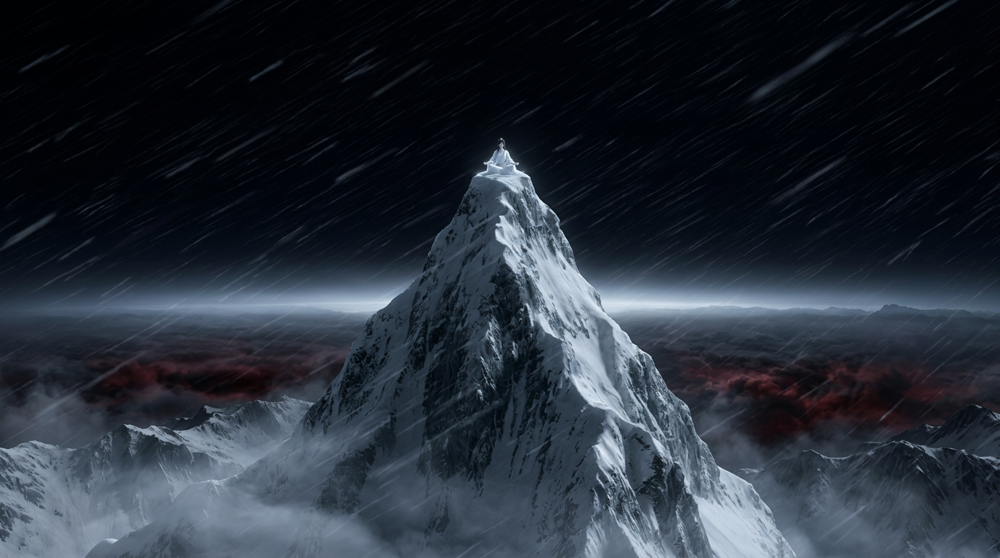
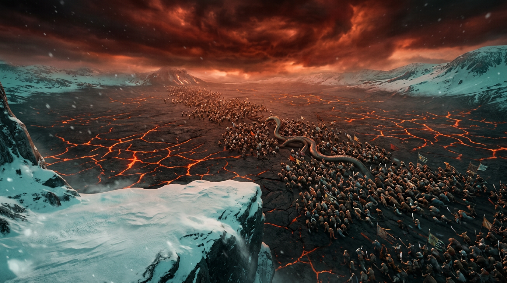
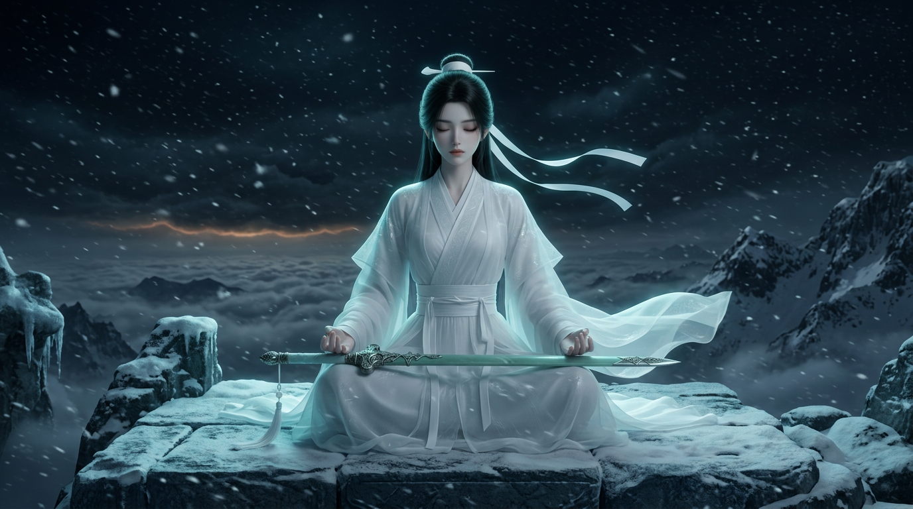
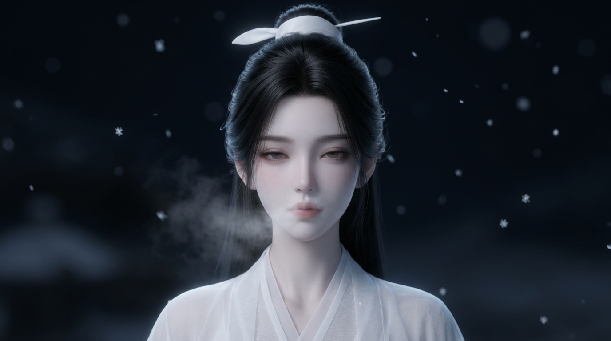
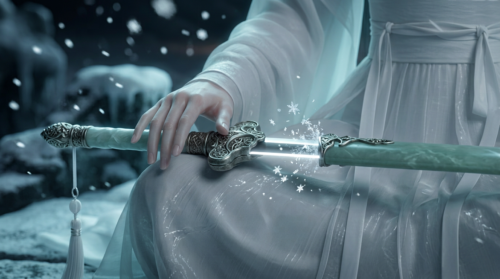
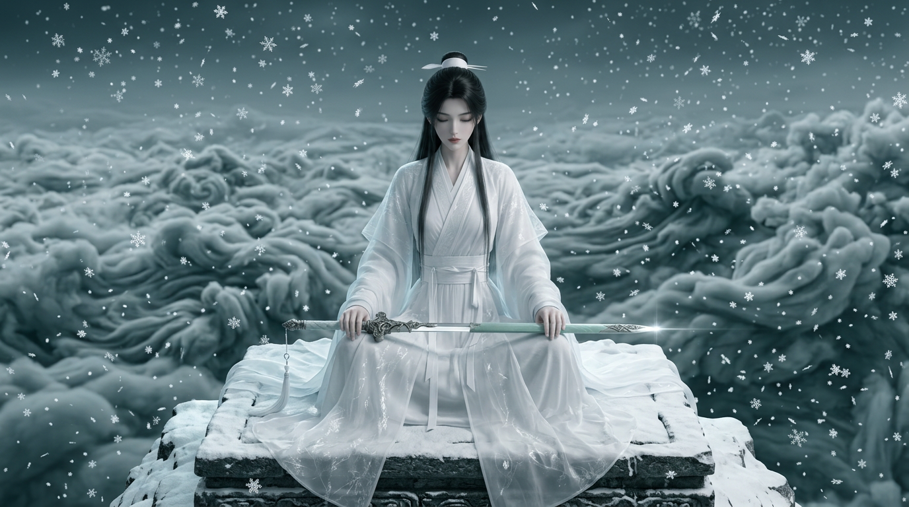
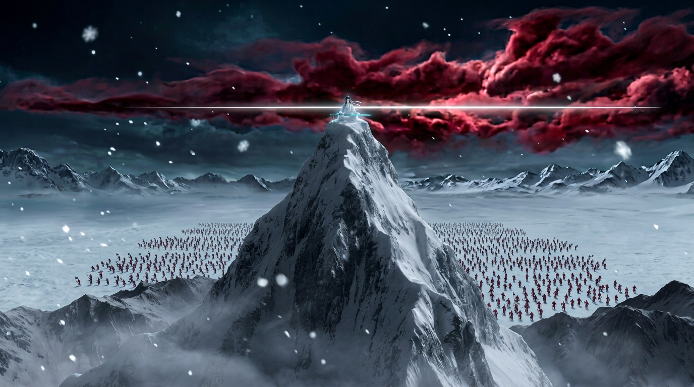
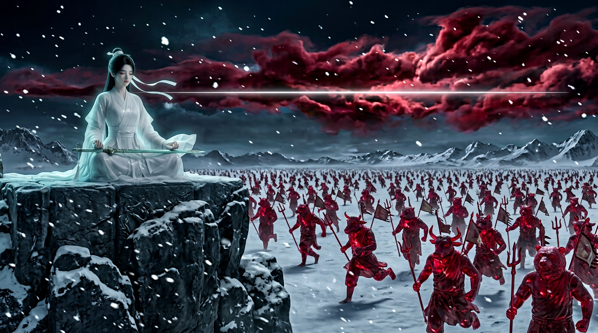
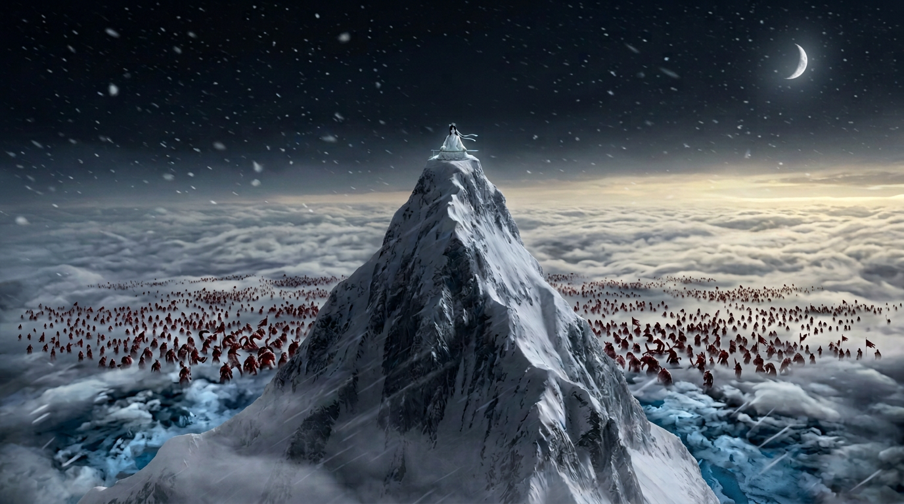

# 《霜华》30秒国风玄幻预告片

> 眉睫结霜的白衣无情道女剑尊，盘坐极峰之巅，拇指挑剑一寸，一线白光平切千里妖潮，山河化作血色冰雕。

## 目录
```
霜华/
├── README.md                     ← 本文件
├── 角色设定/                      ← 角色锚点（uni 1.1 max 生成）
│   ├── 霜华女主正面定妆.png
│   └── 霜华女主三视图.png
├── 场景设定/
│   └── 极峰之巅_场景空镜.png
├── 分镜/
│   ├── 定稿/                      ← 视频生成用这里的图
│   └── 历史版本/                  ← 迭代过程稿，仅供参考
└── 提示词/
    ├── 分镜图提示词_uni1.1max.md   ← 用 uni 重出分镜图
    ├── 视频提示词_Seedance2.5.md   ← ★ 30s 一次生成 / 15s×2
    └── 视频提示词_通用分段版.md     ← 9段分镜式，适用可灵/Vidu/Runway等
```

## 定稿分镜（30秒）
| 时间 | 镜头 | 文件 | 预览 |
|---|---|---|---|
| 0–4s | 孤峰 超远景 | 01_孤峰_超远景.png |  |
| 4–7s | 妖潮压境 俯拍 | 02_妖潮压境_俯拍.png |  |
| 7–10s | 峰顶盘坐 中景 | 03_峰顶盘坐_中景.png |  |
| 10–13s | 睁眼 大特写 | 04_睁眼_大特写.png |  |
| 13–16s | 拇指挑剑 微距 | 05_拇指挑剑_微距.png |  |
| 16–18s | 天地失声 全景 | 06_天地失声_全景.png |  |
| 18–20s | 白光横贯 全景 | 07a_白光横贯_全景.png |  |
| 20–24s | 血色冰封 近景 | 07b_血色冰封_近景.png |  |
| 24–30s | 破晓冰原 远景 | 08_破晓冰原_远景.png |  |

备用：`02b_妖潮近景_备用.png`（妖怪形象清晰的近景，可插在 02 后，或作 07b 的首帧对照）

## 设定要点
- 角色：以定妆图为准——黑发高髻、白发带白玉簪、多层白纱汉服；古剑"霜华"青玉剑鞘、银雕剑格、白剑穗。不加银白发尾与眉睫结霜。
- 妖怪：西游记式兽首人身（牛魔、猪妖、虎妖、狼妖、熊精、蛇妖、狐妖），持钢叉、朴刀、妖旗；禁用西式怪物。
- 色调：冷白灰蓝为主，黑红妖云对比，冰封后转血红。

## 已知问题
- 07a 剑光仍略偏离剑身、未切开红云 → 建议视频阶段生成或后期叠加光效
- 分镜图由 AI 工具生成，画风比 uni 偏写实，最终统一画风建议用 uni 按提示词重出
